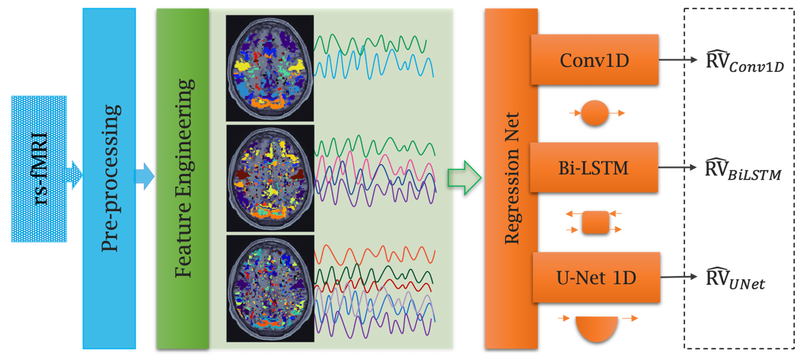

# Deep Physio Reconstruction

## Respiratory Volume (RV) Signal Reconstruction from fMRI Data




Public Pytorch implementation for the **A Deep Pattern Recognition Approach for Inferring
Respiratory Volume Fluctuations from fMRI Data** paper, which was accepted to [MICCAI 2020](https://www.miccai2020.org/en/).


If you find this code helpful in your research please cite the following paper:

```
Bayrak, Roza G., et al. "A Deep Pattern Recognition Approach for Inferring Respiratory Volume Fluctuations 
from fMRI Data." International Conference on Medical Image Computing and Computer-Assisted Intervention. 
Springer, Cham, 2020.
```

The paper can be found [here](https://link.springer.com/chapter/10.1007/978-3-030-59728-3_42).


