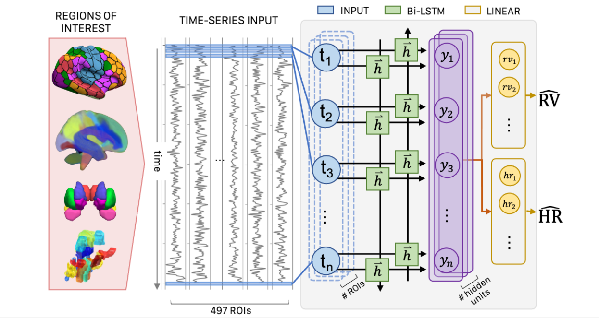

# Deep Physio Reconstruction

## Respiratory Volume (RV) and Heart Rate (RV) Signal Reconstruction from fMRI Data



Public Pytorch implementation for the **From brain to body: Learning Low-Frequency Respiration and Cardiac Signals from fMRI Dynamics** 
paper, which was accepted to [MICCAI 2021](https://www.miccai2021.org/en/).

<!-- 
If you find this code helpful in your research please cite the following paper:

```
Bayrak, Roza G., et al. "From brain to body: Learning Low-Frequency Respiration and Cardiac Signals from fMRI Dynamics." 
International Conference on Medical Image Computing and Computer-Assisted Intervention. 
Springer, Cham, 2021.
``` -->

<!-- The paper can be found [TBA](XXX). -->
